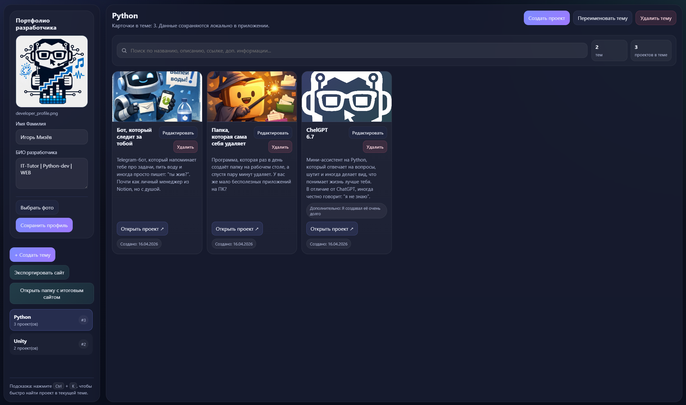
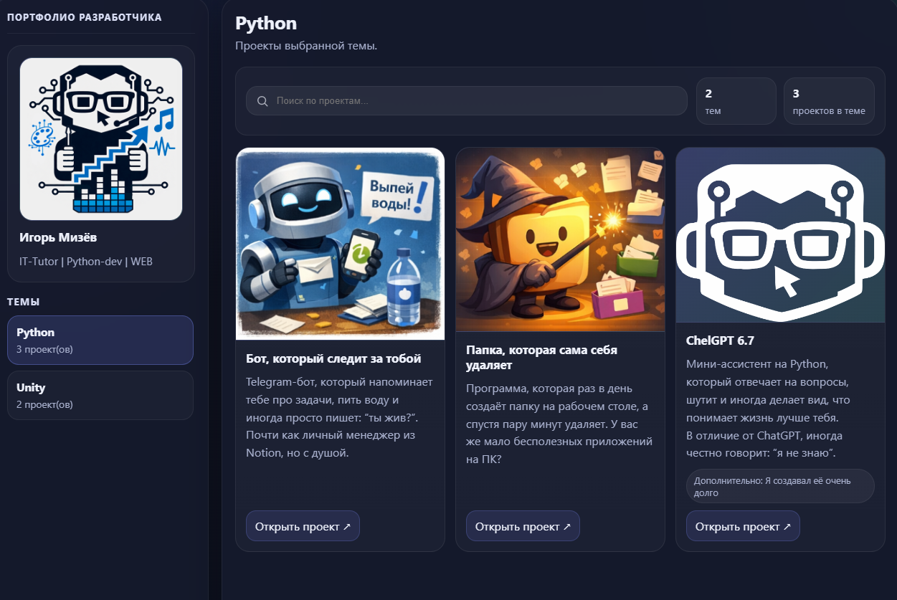

# DevNest Portfolio

Десктопное приложение на Electron для создания портфолио разработчика через удобную админ-панель.  
Пользователь добавляет темы, проекты, описания, ссылки, изображения и фото профиля, переключает язык интерфейса и экспортирует всё в полностью статический сайт.

[Русский](README.md) | [English](README.en.md)

[⬇ Скачать portable-версию](https://github.com/Hasli4/DevNest-Portfolio-app/releases)
| 
[Подробная инструкция по использованию](https://docs.google.com/presentation/d/1NTFoW714LjP0DslB7Ho2XGklaXy732QH1bJjbrQtODo/edit?usp=sharing)

---

## О проекте

Portfolio App — это локальное приложение для быстрого создания портфолио без ручной верстки.  
Всё управление происходит внутри программы: вы создаёте темы, добавляете проекты, загружаете обложки, заполняете описание, переключаете язык интерфейса и экспортируете готовый сайт для публикации.

Проект подходит для:
- личного портфолио;
- учебных проектов;
- демонстрации работ;
- быстрого создания сайта без CMS.

---

## Возможности

- удобная админ-панель;
- переключение интерфейса между русским и английским языками;
- создание, переименование и удаление тем;
- создание, редактирование и удаление проектов;
- загрузка обложек для проектов;
- добавление фото и био разработчика;
- поддержка двуязычных полей для тем, карточек проектов и профиля разработчика;
- локальное сохранение данных;
- экспорт в статический сайт на выбранном языке;
- экспорт двуязычного статического сайта с переключателем языка;
- поиск по проектам в текущей теме;
- совместимость экспортированного сайта с обычным статическим хостингом, включая GitHub Pages;
- portable-сборка для Windows.

---

## Локализация и двуязычность

- В правом верхнем углу основного блока приложения есть переключатель `RU / EN`, который меняет язык всего интерфейса.
- Выбранный язык сохраняется в локальных данных приложения и используется при следующем запуске.
- Если режим `Поддержка двух языков` выключен, экспортированный сайт будет одноязычным и соберётся на том языке, который выбран в приложении в момент экспорта.
- Если режим `Поддержка двух языков` включён, в формах появляются дополнительные поля для русского и английского текста:
  - название темы;
  - имя и био разработчика;
  - название проекта;
  - описание проекта;
  - дополнительная информация по проекту.
- В двуязычном режиме экспортированный сайт получает встроенный переключатель языка и остаётся полностью статическим.
- Перевод содержимого выполняется вручную: это позволяет сохранить автономность сайта без внешних API и сделать его пригодным для публикации на GitHub Pages.

---

## Скриншоты

Админское приложение с возможностью редактирования тем и проектов



Итоговый экспортированный сайт без админ-меню


---

## Технологии

* Electron
* Node.js
* HTML
* CSS
* JavaScript

---

## Как запустить локально

### 1. Установить зависимости

```bash
npm install
```

### 2. Запустить приложение

```bash
npm start
```

---

## Как собрать portable-версию

### 1. Установить зависимости

```bash
npm install
```

### 2. Собрать portable exe

```bash
npm run dist
```

После сборки portable-файл появится в папке `dist`.

---

## Как работает экспорт

Приложение сохраняет данные локально и умеет экспортировать готовый сайт в отдельную папку.

При экспорте создаются:

* `index.html`
* `styles.css`
* `script.js`
* `data.json`
* изображения проектов
* фото разработчика

Экспорт учитывает текущие настройки языка:

- если двуязычный режим выключен, сайт будет собран только на одном выбранном языке;
- если двуязычный режим включён, сайт будет содержать переключатель `RU / EN` и оба варианта заполненного текста.

Готовый сайт остаётся полностью статическим: его можно открыть локально в браузере или загрузить на обычный хостинг.

---

## Где хранятся данные

Локальные данные приложения, фото, обложки и настройки языка сохраняются в папке пользователя приложения.
Это позволяет не терять проекты после перезапуска программы.

---

## Структура проекта

```text
portfolio-app/
├── src/
│   ├── main.js
│   ├── i18n.js
│   ├── preload.js
│   ├── renderer.js
│   ├── index.html
│   └── styles.css
├── build/
├── data/
├── covers/
├── export/
├── README.md
├── README.en.md
├── LICENSE
├── .gitignore
├── package.json
└── package-lock.json
```

---

## Лицензия

Проект распространяется по лицензии, указанной в файле `LICENSE`.

Коммерческое использование не разрешено.
Для коммерческого использования свяжитесь с автором проекта.

---

## Контакты

* Telegram: `@ig_mizyovv`
* Email: `ig.mizyov01gmail.com`


